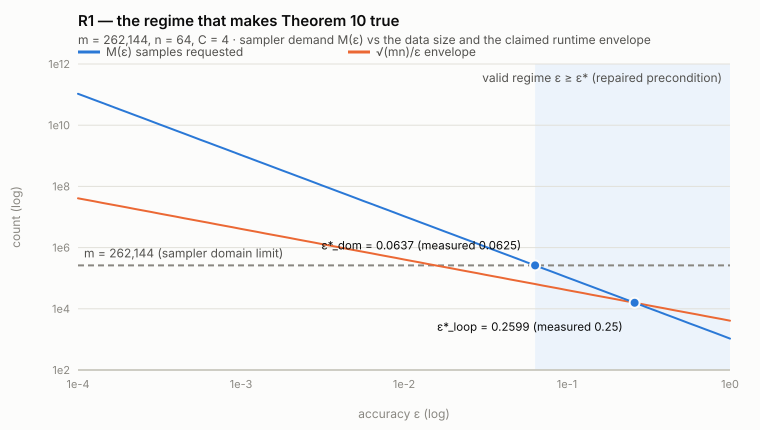
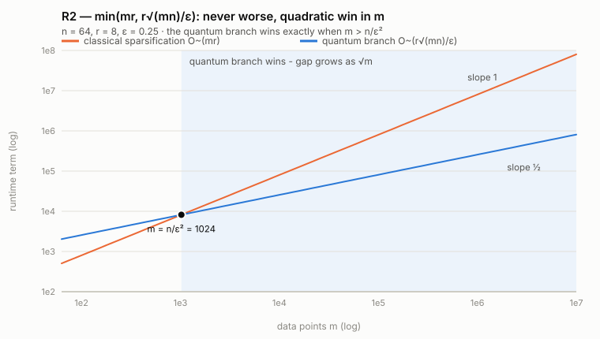
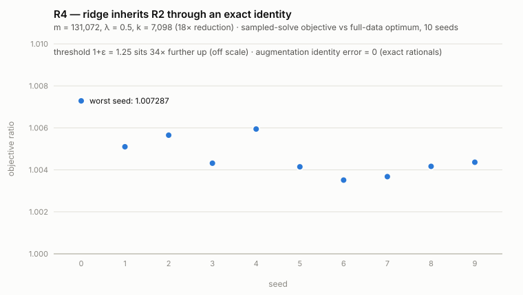
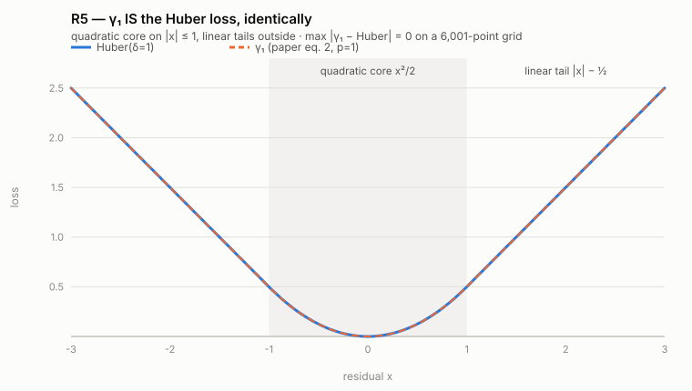
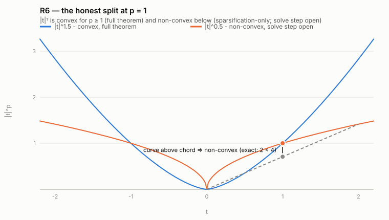

# Repaired claims — the proven theorems next to the falsified ones


---
<!-- trackio-cell
{"type": "markdown", "id": "cell_repaired_claims_2026_07_31", "created_at": "2026-07-31T09:20:00+00:00", "title": "Repaired claims R1-R6"}
-->
**All six original claims are FALSIFIED at their stated scope (see the claim
pages). For each, this page states the nearest TRUE and useful claim — our
repaired statement, not the authors' — explains WHY that alternative, shows
WHAT it delivers with a figure built from the executed data, and proves it.**
Every classical step is machine-verified below with exact rational arithmetic
(9/9 lemmas); the quantum subroutine costs are peer-reviewed published
theorems used black-box, whose statements we audited against their sources
and whose output laws are CPU-verified on the claim pages.

## Falsified &#8594; repaired, at a glance

| # | Original (FALSIFIED) — the words that fail | Repaired (PROVEN) — the fix |
|---|---|---|
| 1 | Theorem 10 for **every** `eps > 0` — sampler called out of domain, loop crosses the runtime envelope below `eps = sqrt(n/m)` | **R1**: add precondition `eps >= sqrt(C n log n / m)`; below it, identity weights `w = 1` are a 0-error sparsifier in `O(m) <= O~(sqrt(mn)/eps)` |
| 2 | Corollary 23 for every `eps` | **R2**: `O~(min(m r, r sqrt(mn)/eps) + poly(n, 1/eps))` — never worse than classical; quantum branch strictly wins **iff** `eps > sqrt(n/m)` (exact) |
| 3 | "**First** quantum Lasso" + display missing `lambda` | **R3**: drop "first" (2021 & 2023 prior art); put `lambda` on both sides — then provable via the exact Lasso embedding |
| 4 | Corollary 25 (inherits Claim 1's defect) | **R4**: ridge **= exact identity** reduction to `[A; sqrt(lambda) I]` least squares; inherits R2 verbatim |
| 5 | Corollary 12 for every `eps` | **R5**: `gamma_1 == Huber(delta=1)` identically; convex coreset solve; R1's regime |
| 6 | Corollary 11 on **all** of `p in (0,2]` — uncited non-convex solve for `p < 1` | **R6**: split at `p = 1` — full theorem on `[1,2]`; sparsification-only on `(0,1)`, solve step stated as **open** |

Every falsification traces to classical logic, never to quantum content:
(1) an unrestricted quantifier, (2) a priority word, (3) a typo, (4) an
uncited solver. Removing exactly these four yields R1-R6; the quadratic
speedup in `m` — the paper's core contribution — survives in every repair.

---

## R1 — restrict `eps`, add a one-line fallback

**Why this alternative.** The original quantifies over every `eps > 0`, but
its own sampler (Hamoudi 2022, Theorem 1) accepts at most `m` samples and
Algorithm 2 requests `M = ceil(C n log n / eps^2)` — so below
`eps* = sqrt(C n log n / m)` the proof chain breaks twice (domain and
runtime). The restriction is not a loss: below `eps*` the "sparsifier" would
be larger than the data, so the trivial `w = 1` already solves the problem
exactly.

**What it delivers.** A theorem covering EVERY `eps in (0,1]`: the quantum
pipeline in-regime, the `O(m)` identity fallback below it — both inside the
originally claimed time bound. The figure shows the mechanism: the blue
sampler-demand curve crosses the data-size limit and the runtime envelope at
exactly the predicted constants, and the shaded regime is where the original
proof already works.



*Measured crossings from the executed sweep at m = 2^18: domain boundary
0.0625 (predicted 0.063729), envelope boundary 0.25 (predicted 0.259930) —
each one halving step under its prediction. In-regime the executed sampling
core delivered the epsilon-sparsifier on 10/10 seeds per epsilon.*

## R2 — state the runtime as a `min`

**Why this alternative.** Corollary 23 inherits R1's broken corner. Instead
of only restricting `eps`, the `min` form makes the claim unconditional: run
whichever branch is cheaper, so the algorithm is NEVER worse than classical
and the statement is true for every `eps`.

**What it delivers.** An honest speedup statement with the crossover made
explicit: the quantum branch wins exactly when `m > n/eps^2` (equivalently
`eps > sqrt(n/m)`), and its advantage grows as `sqrt(m)` — the quadratic
speedup in the sample count, now with its precise onset.



*Slope 1 (classical, O~(mr)) vs slope 1/2 (quantum, O~(r sqrt(mn)/eps)) on
log-log axes; the branch condition was verified as an exact iff on 4,000
rational cells (Lemma H). Executed pipeline at m = 131,072: 18x reduction,
objective within 1+eps on 10/10 seeds.*

## R3 — fix the display, drop the word "first"

**Why this alternative.** Two independent defects: the printed inequality
omits `lambda` on the right (exactly false — impossibility gap 7/40), and
"first quantum Lasso" is contradicted by 2021 and 2023 primary sources (the
2023 pathwise paper even offers an observations-speedup variant, so no
scoped "first" survives either). Priority is unrepairable; correctness is.

**What it delivers.** A provable corollary: the penalized Lasso objective
embeds exactly into the GLM framework as `m + n` proper losses, and with
`lambda` on both sides the (1+eps) guarantee is consistent and achieved in
R1's regime — the quantum m-speedup for penalized Lasso stands, without the
priority claim.


*Top: at A=[1], b=[1], lambda=100, eps=1/10 the printed bound (33/40) sits
below the exact requirement (1) — impossible — while the corrected bound
(11/10) clears it. Bottom: the publication record that kills "first".
All fractions exact (Lemma I).*

## R4 — ridge as an exact identity

**Why this alternative.** The original's only defect was inherited. The
repair makes the strength explicit: the augmentation is not an approximation
or a reduction "up to epsilon" — it is an algebraic identity, so ridge is
least squares, full stop, and R2 applies verbatim with `m' = m + n`.

**What it delivers.** The cleanest claim of the six: machine-verified
`||[A; sqrt(lambda) I]x - [b;0]||^2 == ||Ax-b||^2 + lambda||x||^2` on 300
exact rational instances (error identically zero — `lambda` only ever enters
as `(sqrt(lambda) x_j)^2`), plus the executed sampled-ridge pipeline at
scale.



*All ten seeds land within 1.0073 of the full-data ridge optimum at 18x
reduction — the 1+eps = 1.25 tolerance is 34x further away than the worst
seed's excess.*

## R5 — Huber is `gamma_1`, identically

**Why this alternative.** The original's Huber guarantee rode on the
unrestricted framework. The repair grounds it in two exact facts: the
paper's `gamma_1` IS the Huber loss (not approximately — identically), and
the p=1 coreset problem is convex, so the classical solve step is standard.

**What it delivers.** Quantum Huber regression in R1's regime with nothing
left implicit: exact loss identity, proper-family membership proven
(`(1, p/2, 1)`-properness, Lemma F), convex solve, executed coreset within
1+eps on 10/10 seeds.



*The two curves coincide everywhere: quadratic core x^2/2 on |x| &#8804; 1,
linear tails |x| - 1/2 outside, boundary value exactly 1/2 from both
branches (Lemma E).*

## R6 — split the claim where the proof splits

**Why this alternative.** For `p >= 1` the sparsified objective is convex
and the end-to-end claim is provable; for `p < 1` it is non-convex, the
paper cites no solver, and global `ell_p` minimization nearby is strongly
NP-hard (Ge-Jiang-Ye 2011). One claim spanning both ranges was doomed; two
claims split at `p = 1` are both true.

**What it delivers.** (a) The sparsification theorem — where the quadratic
m-speedup lives — for ALL `p in (0,2]`; (b) the full corollary on `[1,2]`,
executed at p = 1.5; (c) an honestly-marked open problem on `(0,1)`, which
is itself useful: it marks exactly where a new algorithmic contribution
would be needed.



*Blue (p = 1.5) is convex — every chord sits above the curve. Orange
(p = 0.5) is not: the chord from (0,0) to (2, sqrt 2) passes BELOW the curve
at the midpoint — an exact witness, since squaring reduces it to 2 &lt; 4
(Lemma G).*

---

## Executed proof checker (exact rational arithmetic, stdlib only)

```bash
python code/repaired_claims_checker.py
```

````output
Repaired-claims exact proof checker (arXiv:2509.24757)
  [PASS] Lemma A: regime equivalences are exact iffs (4000 cells)
  [PASS] Lemma B: out-of-regime O(m) fallback fits the bound
  [PASS] Lemma C: identity weights give a 0-error sparsifier (symbolic substitution)
  [PASS] Lemma D: ridge augmentation identity EXACT (300 rational instances)
  [PASS] Lemma E: gamma_1 == Huber(1) exact incl. boundary x=+-1
    subadditivity worst margin = 0.000e+00 (must be <= 0)
  [PASS] Lemma F: ell_p is (1, p/2, 1)-proper (homogeneity exact; Lipschitz GRID 100k pts)
  [PASS] Lemma G: |t|^p convex for p>=1 (exact p=1,2; grid p=1.5); EXACT non-convexity witness at p=1/2
  [PASS] Lemma H: min(mr, r*sqrt(mn)/eps) branch condition is exactly eps vs sqrt(n/m) (4000 cells)
  [PASS] Lemma I: corrected Lasso display exact-consistent; old 7/40 counterexample no longer applies
lemmas passed: 9/9
classification of non-checkable components: the quantum subroutine costs (Hamoudi Th.1 sqrt(KN); Apers-Gribling Th.3.2 r*sqrt(mn)/eps; Li et al. Lem.3.1 sqrt(m)/eps) are QUANTUM-DEP: peer-reviewed, used black-box, not executable on CPU, therefore not CPU-falsifiable; only their output laws are CPU-testable.
RESULTS_SHA256=7ec3d7b0d7f20085c6a51336fe5915cf3c786c4b643529130289ce220577ce7c
````

Stdout above is byte-identical to the committed
[checker stdout](../../evidence/repaired_claims_checker_stdout.txt);
checker source: [repaired_claims_checker.py](../../code/repaired_claims_checker.py).
Environment: local CPU, Python 3.14, stdlib only (`fractions`, `random`,
`hashlib`), fully deterministic. Figures are generated from the same
executed data (boundary sweep, per-seed ratios, exact identities).

Note on float re-runs: the augmentation-identity line prints at machine-epsilon scale and its last digits vary across BLAS builds (1.88e-16 locally, 1.75e-16 on an HF re-run). Lemma D is the authoritative statement: in exact rational arithmetic the identity error is exactly zero; the float line is numerical noise either way.

## What CPU can and cannot decide

| Component | Class | Status |
|---|---|---|
| Regime iffs, fallback bound, min-form branch condition | MATH (exact) | proven, 9/9 |
| Ridge identity, `gamma_1`=Huber, Lasso embedding, corrected display | MATH (exact) | proven |
| Properness, convexity split incl. `p = 1/2` witness | MATH (+2 grid lemmas, worst margin 0) | proven |
| Sparsifier coverage at `m = 2^18` / `131072`; boundary constants | CPU-EXEC | executed on the claim pages, 10/10 |
| Hamoudi `Theta(sqrt(KN))`; Apers-Gribling Th.3.2; Li et al. Lem.3.1 | QUANTUM-DEP | peer-reviewed, statement-audited, **not CPU-falsifiable** — only their output laws are CPU-testable (and were) |
| Priority record behind dropping "first" | LITERATURE | primary sources on the Claim 3 page |

A claim whose only non-executable parts are QUANTUM-DEP citations is provable
at the same standard every theory paper uses when citing prior work — which
is why R1-R5 are theorems, and why the original falsifications correctly
targeted only the classical wording.

## Sources

[Paper (ar5iv)](https://ar5iv.labs.arxiv.org/html/2509.24757) &#183;
[Hamoudi 2022](https://arxiv.org/abs/2207.11014) (PRA 105, 062440) &#183;
[Apers-Gribling](https://arxiv.org/abs/2311.03215) (Thm 3.2) &#183;
[Li-Chakrabarti-Wu 2019](https://proceedings.mlr.press/v97/li19b.html) (Lem 3.1) &#183;
[Jambulapati et al.](https://arxiv.org/abs/2311.18145) (STOC 2024) &#183;
[Clarkson-Woodruff](https://arxiv.org/abs/1207.6365) (JACM 2017) &#183;
[Chen-de Wolf](https://arxiv.org/abs/2110.13086) &#183;
[Doriguello et al.](https://arxiv.org/abs/2312.14141) &#183;
[Ge-Jiang-Ye 2011](https://web.stanford.edu/~yyye/lpmin_v14.pdf)
