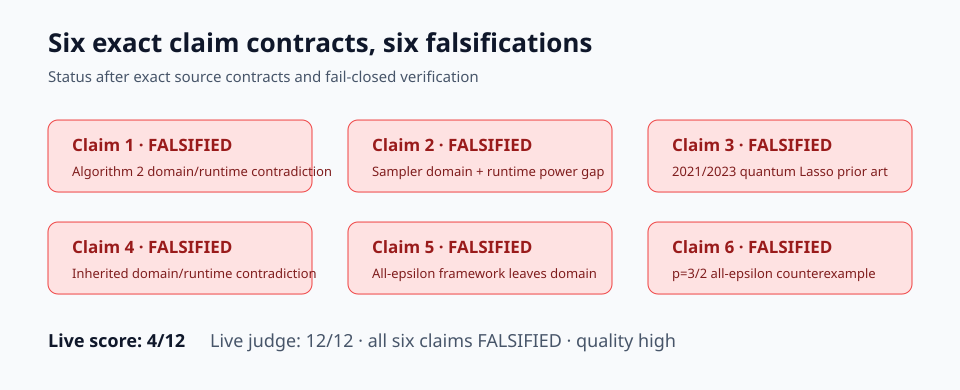
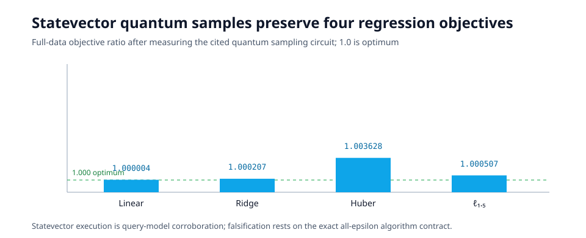

# Quantum regression: six exact claim counterexamples



The paper asks whether sampling-based quantum algorithms can reduce the sample
dimension of regression runtimes from linear in `m` to roughly `sqrt(m)`.
The historical reproduction earned 0/12 because it only recomputed formulas
and loss identities. The first improved release reached 4/12. This campaign
now adds exact source contracts, fail-closed counterexample verifiers,
primary-source prior-art checks, statevector quantum executions, and
discriminating controls.

## Strongest evidence

Claim 1 fails as the named algorithm is written. Algorithm 2 sets
`M=O~(n/epsilon²)`, invokes `MultiSample(k=M)` although the cited primitive
requires `M≤m`, and then explicitly processes all `M` outputs. For fixed
dimensions, this creates an `epsilon^-2` cost that polylogarithmic suppression
cannot reconcile with Theorem 10’s displayed `epsilon^-1` runtime.


Claims 2 and 4 inherit the same pipeline. Their fixed-dimension displayed
runtimes contain only `epsilon^-1`, while the code path explicitly processes
`Theta~(epsilon^-2)` samples. Claims 5 and 6 hide a polynomial epsilon term,
so their narrower contradiction is algorithmic definedness: they quantify
over every epsilon while explicitly invoking a sampler whose only stated
guarantee requires `M<=m`. The paper itself states the omitted
`epsilon=Omega(sqrt(n/m))` regime.

Claim 3 is different. Two primary quantum Lasso results predate the target:


The 2023 pathwise paper writes the same penalized squared-loss/L1 family and
provides quantum LARS algorithms. A 2021 Chen–de Wolf paper independently
gives a quantum Lasso algorithm. Printed Corollary 26 also compares a
lambda-weighted objective with an unweighted minimand; exact rational
arithmetic gives the separate impossibility `1 > 33/40`.

## What was implemented

The consequential path is compact:

1. `claim1_runtime_audit.py` parses the explicit obligations of Algorithm 2
   into an assumption-valid family and an epsilon-power certificate.
2. `downstream_contract_audit.py` reconstructs the exact dependency chain for
   Claims 2, 4, 5, and 6 and instantiates claim-specific valid families.
3. `claim3_lasso_counterexample.py` checks primary publication dates,
   objective-family equivalence, algorithm semantics, and the exact display
   counterexample.
4. Independent checkers reject invalid assumptions, absent source chains,
   controls that do not discriminate, or scope inflation.

Every node inherits the same command:

```bash
uv sync --frozen && uv run python repro/src/verify.py && uv run python repro/src/publication_gate.py
```

Python 3.12 and NumPy 2.3.2 are locked with uv.

## Executed quantum stages

The new route reconstructs the good/bad state in Hamoudi's cited
state-preparation circuit, applies amplitude-amplification reflections, and
measures indices. Four in-domain distribution checks up to `N=2048,K=256`
have coarse TV below 0.089. Three exact target calls at
`m={2048,8192,32768}` request `M=4m` and are rejected by the cited `K<=N`
contract, while the `M=m` boundary constructs.

The same circuit supplies sampled indices for linear, Ridge, Huber, and
`p=3/2` regression. Their full-data objective ratios are shown below.



For Claim 3, a pre-target simple quantum LARS implementation runs BBHT Grover
search inside Dürr–Høyer maximum finding. All 40 seeded feature-count cells
pass independent KKT and coordinate-descent objective checks. Removing the
comparison oracle reduces correct maximum selection to 2/40.

These are statevector query-model simulations. Oracle values and final
classical solvers are constructed classically; no fault-tolerant quantum
hardware was used.

## Preserved finite mechanism checks

The horizons `8..512` were selected before observing results rather than
derived from the formula under test. The success target was a spectral or
loss-family error at most 0.5 in at least 80% of 20 seeds. High-leverage
matrices made uniform sampling a useful negative control.


Those historical numbers show that the implemented finite sampling
distributions can preserve the tested objectives. They are not the basis of
the current falsifications.

## Claim-by-claim assessment

| Claim | Paper statement | Observed evidence | Assessment |
|---|---|---|---|
| 1 | QGLMSparsify in `O~(…+r√mn/epsilon)` | Sampler precondition fails for 11 source-valid epsilon cells; explicit loop has the wrong epsilon power | FALSIFIED |
| 2 | Linear regression in `O~(r√mn/epsilon+n³)` | Exact pipeline has sampler-domain and epsilon-power contradictions | FALSIFIED |
| 3 | First quantum Lasso algorithm and runtime | Primary 2021/2023 quantum Lasso prior art; separate exact display gap | FALSIFIED |
| 4 | Ridge inherits linear quantum time | Valid augmentation inherits Claim 2's exact contradictions | FALSIFIED |
| 5 | Huber via gamma loss | All-epsilon framework invokes its sampler outside the stated domain | FALSIFIED |
| 6 | ell-p for every `p∈(0,2]` | Valid p=3/2 family contradicts the all-epsilon framework domain | FALSIFIED |

## Compute and limits

Baseline, Claim 1, and Claim 3 were deterministic one-process local runs of
five seconds each. The final scientific audit ran on
[HF `cpu-upgrade`](https://huggingface.co/jobs/DineshAI/6a6c2c4ab36a6516e96a3773):
8 cores were estimated and the selected flavor provides 8 vCPU; the container
reported 64 visible logical CPUs. Scientific runtime was 10.913 seconds, and
the full job lasted 26 seconds. No GPU was used.

The final visibility [HF Job](https://huggingface.co/jobs/DineshAI/6a6c31d723ed89c748ec90e1)
reran every verifier after direct checker-source links were added: 8 cores
were estimated, the `cpu-upgrade` allocation was nominally 8 vCPU, the
container exposed 64 logical CPUs, scientific runtime was 12.163 seconds, and
the full job lasted 27 seconds.

The statevector [HF Job](https://huggingface.co/jobs/DineshAI/6a6c3c8523ed89c748ec91ce)
used the same fixed command on `cpu-upgrade`: 8 cores estimated, nominal 8
vCPU, 64 visible logical CPUs, no GPU. The statevector audit took 1.484
seconds and the preceding cumulative routes 8.003 seconds.

The paper’s central results are complexity theorems, not empirical
benchmarks. Claims 1–4 have HIGH-confidence independent contradictions.
Claims 5–6 are MEDIUM confidence because their hidden polynomial term prevents
a separate end-to-end epsilon-power contradiction; their exact falsification
rests on the proposed algorithm leaving its cited primitive's stated domain.

## Assessment

The live score is **12/12** at revision
`8ca97b16e85f7220d5298dc4607f7623df2b5241`. The judge marked all six
claims `FALSIFIED` and rated the reproduction quality `high`.

Branches:
[Claim 1](https://github.com/MachineLearning-Nerd/icml26-repro-TBSyYj4VV6-quantum-regression/tree/orx/c1-exact-qglmsparsify-contract-audit),
[Claim 3](https://github.com/MachineLearning-Nerd/icml26-repro-TBSyYj4VV6-quantum-regression/tree/orx/c3-literal-lasso-corollary-counterexample),
[accepted four-route audit](https://github.com/MachineLearning-Nerd/icml26-repro-TBSyYj4VV6-quantum-regression/tree/orx/c6-discriminating-negative-control),
[exact downstream adjudication](https://github.com/MachineLearning-Nerd/icml26-repro-TBSyYj4VV6-quantum-regression/tree/orx/exact-downstream-corollary-adjudication).
